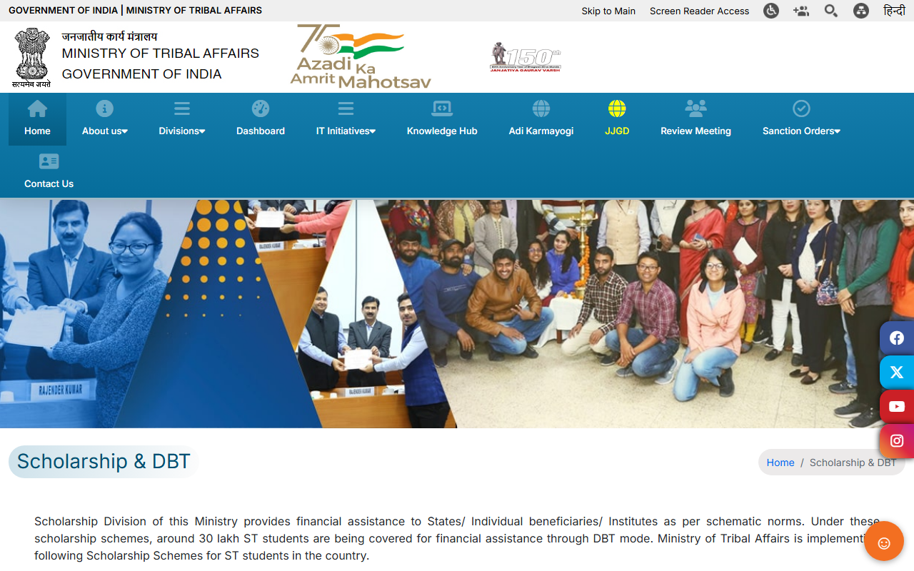
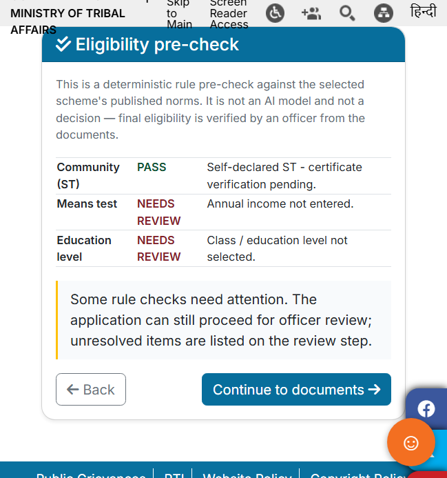
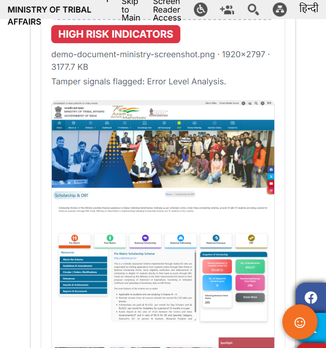
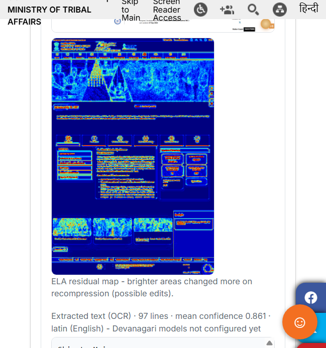
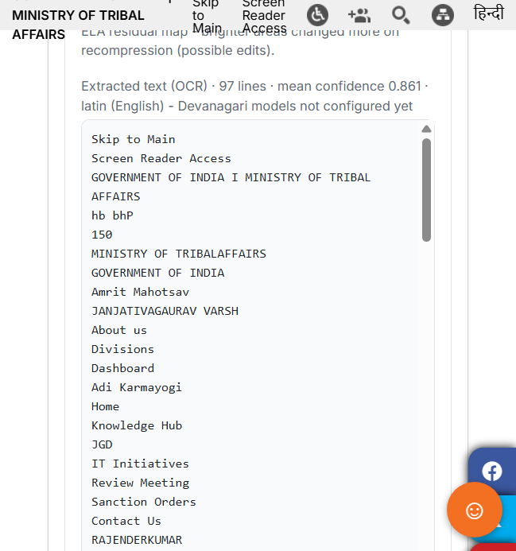

# Scholarship & Fellowship Management System

An AI-assisted, end-to-end digital platform for managing scholarship and fellowship applications — from applicant registration and document submission to verification, deficiency tracking, selection, and administration.

## The Problem

Scholarship and fellowship scheme administration typically involves manual scrutiny, repeated correspondence, and multi-level verification. This causes processing delays, repetitive administrative effort, limited real-time visibility, and room for errors in verification and workflow management.

## The Solution

A single, secure, configurable platform that brings the complete process — application submission, eligibility verification, document scrutiny, selection, communication, and post-application management — onto one integrated system with separate interfaces for applicants and administrators.

## Key Features

- **End-to-end digital applications** — registration, scheme selection, form submission, document upload, and status tracking.
- **Configurable schemes** — eligibility criteria (income limit, minimum marks) and required documents are stored per scheme in the database, so new schemes can be added without code changes.
- **AI-assisted document verification** — uploaded documents are sent to a FastAPI AI service that runs OCR (EasyOCR, English + Hindi) and returns extracted text with a confidence score for officer review.
- **Deficiency workflow** — officers can flag incomplete or deficient documents; applicants see the reason, respond, and resubmit.
- **Application tracking** — applicants track every application and its verification status in real time.
- **Audit trail** — every action on an application is logged (`audit_logs`) for transparency and accountability.
- **Human oversight retained** — AI output (OCR text, confidence) supports decisions but never replaces them; final verification and selection stay with the officer.

## Screenshots

Applicant portal — scheme listings and application entry point:



Eligibility pre-check — deterministic rule checks against the selected scheme's published norms (officer verification still applies):



AI document screening — an uploaded scan is screened and returned with a risk label and the tamper signals that caused it:



Error Level Analysis residual map — brighter areas changed more on recompression, flagging possible edits for human review:



OCR extraction — text pulled from the document with per-run confidence, shown beside the screening result:



## Tech Stack

| Layer | Technology |
|---|---|
| Backend API | Node.js, Express |
| Database | PostgreSQL (JSONB for flexible scheme/document data) |
| AI Service | Python, FastAPI, EasyOCR |
| Auth | JWT + bcrypt |
| File Uploads | Multer |
| Frontend | Static HTML/JS (served by the backend, also deployable via GitHub Pages) |

## Architecture

```
frontend (static HTML/JS)
        │
        ▼
backend (Express, :5000)  ──────►  PostgreSQL
        │
        ▼
ai-service (FastAPI, :8000)  ──►  EasyOCR (en + hi)
```

- `backend/services/aiClient.js` forwards uploaded documents to the AI service and stores the extracted text and confidence back on the document record.
- The AI service falls back to a clear error response if the OCR engine is unavailable — the app continues to work with manual review.

## Getting Started

### Prerequisites

- Node.js 18+
- PostgreSQL 14+
- Python 3.10+

### 1. Database

```bash
createdb scholarship_db
psql -d scholarship_db -f backend/db/schema.sql
```

### 2. Backend

```bash
cd backend
npm install
cp .env.example .env   # fill in DATABASE_URL and a strong JWT_SECRET
npm start              # http://localhost:5000
```

### 3. AI Service

```bash
cd ai-service
pip install -r requirements.txt
uvicorn main:app --port 8000   # http://localhost:8000
```

The first OCR run downloads EasyOCR models, so allow a few minutes.

## API Overview

| Method | Endpoint | Purpose |
|---|---|---|
| POST | `/api/auth/register` | Create applicant/admin account |
| POST | `/api/auth/login` | Issue JWT |
| GET | `/api/schemes` | List active schemes |
| POST | `/api/applications` | Submit an application |
| GET | `/api/applications/mine` | Applicant's own applications |
| GET | `/api/applications` | Officer view of all applications |
| POST | `/api/documents/:applicationId/upload` | Upload document (triggers OCR) |

## Data Model

- `users` — applicants and administrators (role-based)
- `schemes` — configurable scheme eligibility rules and required documents
- `applications` — form data, workflow status, AI risk score, OCR confidence, officer remarks
- `documents` — uploaded files with extracted text and verification status
- `deficiencies` — flagged issues and applicant responses
- `audit_logs` — immutable action history

## Current Status & Roadmap

Working: auth, scheme CRUD, application submission, document upload with OCR extraction, deficiency records, audit logging.

Planned: admin dashboards and analytics, rule-based eligibility auto-checks, merit ranking, email/SMS notifications, and post-selection management.

## License

Private — all rights reserved.
